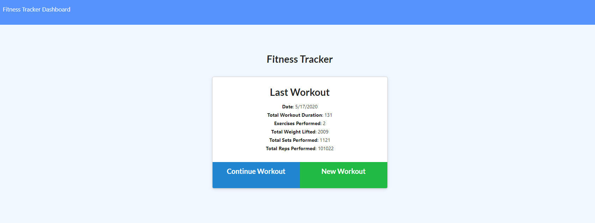

## Kerry-Jr
# **Project Name**
# Fitness Tracker App - HOMEWORK -

# **Table of Contents**
#### Fitness Tracker App homework

- Project Name
- Installation
- Screenshot
- Technologies Used
​- Project Description
- Difficulties Faced
- Future Development
- License
 
# **Contributors**
My Tutor and study groups

# **Installation**
NPM I

# **Screenshot** 

# **Technologies Used**

-Node.js
-Javascript
-Express
-Mongoose.js
-mongoDB

# **Usage**

To track healthy habits

# **Project Description**
Build a backend in node, express, mongoose js, and mongoDB for a fitness tracker app front end.
# **Difficulties Faced**

-Node.js (pure backend, someone elses code)

# **TEST**

no jest, install and start tracking

# **License**
Licensed under [MIT](https://spdx.org/licenses/MIT.html).

[My Email. Please click me to send a message](mailto:kerrysfs@gmail.com)

[Github repo link](https://github.com/Kerry-Jr "Your github repo")

